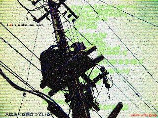

# 電線の在る風景
Text: Last Modified at Nov. 01, 1999.

## はじめに

これは、「serial experiments lain」に関する用語辞典である。
lain のシナリオ集 [『scenario experiments lain』](#scenario-experiments-lain-the-series)、ムック[『visual experiments lain』](#visual-experiments-lain)、 画集[『an omnipresence in wired』](#an-omnipresence-in-wired)が現在発売されており、 lain に関する基礎資料は出揃っている。
そこで、この用語辞典では、これらの内容とあまりクロスオーバーしないよう、登場人物の紹介などには力点を置かず、わたしたちが繋がっているどこかと、こちら側が交差する狭間に存在する事柄を中心に構成した。

## 数字

### 1947 年 7 月 4 日

[\[4\]](#ufo-the-government-files)
[\[5\]](#truth-of-99-preposterous-paranormal-phenomena)
[\[6\]](#mu-jul-1997)
[\[7\]](#ufo-encyclopedia)
[\[8\]](#angles-and-aliens)

ことの起こりは実は同年 6 月 24 日のケネス・A・アーノルドによる目撃事件なのかもしれない。

その日、アーノルドはカスケード山脈上空において飛行機を操縦中に、高速で編隊飛行する 9 つの三日月型の物体を目撃した。
この話を聞いて集まった人々に、アーノルドは物体が飛行する様子を、「投げた皿(saucer)が水面を飛び跳ねるように」と形容した。
この証言をもとに、マスコミは「空飛ぶ円盤(flying saucer)」という呼称を 使用する。
かくして、この日「空飛ぶ円盤」が誕生したのである。
この事件の報道により、 UFO と言えば、まず円盤という形状のイメージが定着してしまう。
そして、「空飛ぶ円盤」の話題は、一気に全米に広まり、 UFO フィーバーがおとずれ、目撃報告が各地から相次いで寄せられることになる。

さて、問題の翌 7 月の事件は、有名な「ロズウェル事件」である。

この事件を最初に報道したのは、 1947 年 7 月 7 日付けのロズウェル・デイリー ・レコード紙の 「RAAF Captures Flying Saucer On Ranch in Roswell Region」という 記事であった。
この記事によって、 RAAF(ロズウェル陸軍飛行場) がロズウェル近郊の牧場において牧場主の発見した円盤を回収したという、 1 将校の談話が、 7 月 7 日の昼の RAAF 情報部の発表として報道されてしまった。
またこの記事には、 7 月 2 日の夜、ロズウェルに住むウィルモット夫妻が、輝く大きな物体が飛び去るのを目撃したという話も付け加えられている。

しかし、「観測気球の間違いだった」というレイミー准将の公式の否定会見がラジオで行なわれ、 7 日 8 日の同新聞でも、これが報じられた。
この結果、この事件は、人々からしばらくの間忘れ去られることになる。
なお、同新聞には、この墜落物体を発見した牧場主 W・W・ブレーゼルのインタビューも載っている。
これによれば、墜落物体を最初に発見したのは、なんと 6 月 14 日であったという。 その日は急いでいたので、 7 月 4 日に再びその場所へ行き、残骸の一部を拾った。 そして 7 月 5 日に、初めて「空飛ぶ円盤」の話を聞き、 7 月 7 日に保安官に連絡したというのだ。

以上のように、ロズウェル事件は、最初の報道からして、だいぶ混沌としたものであった。

ところで、しばらく忘れ去られていたこの事件は、 1980 年に出版された本で 蒸し返され、第 2、第 3 の墜落現場、 MJ-12、MIB、宇宙人の死体を回収、死体の解剖フィルム等々、物議を醸し出す数々のアヤシイ品々が登場することになる。

なお、墜落した観測気球は、だいぶ後の 1994 年になって、モーガル計画のものである可能性が高いと発表された。
この極秘計画の目的は、上空を伝わる低周波の音波をキャッチして、ソ連の核実験を観測することだったという。

-   ケネス・アーノルド事件
<http://web.ukonline.co.uk/voyager/saucers.htm>
-   ロズウェル事件
<http://www.abqjournal.com/roswell/>

## あ行

### アイソレーション・タンク / Isolation Tank

[\[9\]](#scientist)
[\[10\]](#new-age-book)
[\[11\]](#paradigm-book)

ジョン・C・リリーが、人間の脳の働きを研究するために開発したタンク。
暗い水層に、体温に合わせた、比重の重い液体を充満したものである。

当時、脳の自律性、即ち「果して脳は外部からの刺激なくしても、活動するものなのだろうか?」ということが問題になっていた。
アイソレーション・タンクは、この問に答えるために作られたもので、人間になるべく外部からの刺激を与えないようになっている。

このタンクの中の感覚剥離の経験は想像を絶するものであった。
人はそこで寄る辺なき精神の生み出した幻覚を見ることとなったのである。
幻覚、臨死体験、意識の拡大、そして地球外生命体との交流、この宇宙の創世パノラマなどなど。

### IP

[\[12\]](#rfc)
[\[13\]](#open-source-software)
[\[14\]](#tcp-ip-network-administration)

IP は、 Internet Protocol の略で、 BSD UNIX に最初に実装された TCP/IP の基幹をなすプロトコルである。

TCP/IP のレイヤー構造では、最下層にネットワーク・アクセス・レイヤーが位置し、 IP はその上のインターネット・レイヤー、 TCP がその上のトランスポート・レイヤーで、この上にアプリケーション・レイヤーが構成される。

IP の役割は、データをパケットに分割して、通信相手に配送することである。

現在、広く利用されているのは IPv4 (IP version 4) で、この基本的な部分は RFC791 で規定されている。
次世代のプロトコルとして、 IPv6 (基本的な部分は RFC1883 で規定)が研究されている。
なお、 IPv5 は、 ST2(Internet Stream Protocol version 2 / RFC1190(廃止)) という、ストリーミング用の実験的プロトコルであり、次世代 IP ではない。

IPv4 では、 IP address は 127.0.0.1 などと表されるように、 8 bit × 4 = 32 bit のアドレス空間を持っているが、最近ではこのアドレス空間の枯渇が問題になっている。

IPv6 では、アドレス空間を 16 bit × 8 = 128 bit に拡張している。
そして、 IPv4 との互換性を保ちながら、パケット転送処理効率の向上、拡張可能性、フロー処理機能などを持った仕様になっている。

lain の世界では、 6 番目のプロトコルが現行のものとなっているが、スループットの限界の問題や、重大なバグがあるとの噂がたっており、次世代、 7 番目のプロトコルに関心が寄せられている。 英利政美は、この 7 番目のプロトコルの開発に関与した。

-   WIDE の IPv6 ワーキング・グループ
<http://www.v6.wide.ad.jp/>

### 赤と緑の縞の服
[\[7\]](#ufo-encyclopedia)
[\[15\]](#cosmic-trigger)

ヨーロッパの妖精レプラコーンや、アメリカの幻覚サボテン・ペヨーテの精メスカリートのように、人々が宇宙からの訪問者の存在に脅えるようになる以前から、赤と緑の色をした小人の伝説は存在した(日本の場合、敢えて言えば、河童か?)。
なんらかの元型のようなものがあるのかもしれない。

宇宙人も、最初 SF などの影響から、緑色の肌をした生物に描かれることが多かった。
最近はグレイ・タイプのものが主流になりつつある。

### アクセラ/Accela

ナノテクを使った神経に作用する機械で、 一種のドラッグのようなもの。

服用されたアクセラは、消化によって効力が喪失するまで、ある種の周波数を出し、これがホルモン分泌を促す。
この効果によって、意識が加速したような状態になるだけでなく、実際に脳の働きも活性化されるという。

サイベリアに玲音が初めて行ったときに、アクセラのフラッシュ・バックで興奮した若者による射殺および自殺事件が発生した。
この事件の取り調べの結果、岩倉家の虚構性が垣間見えることになる。

### イモーター

[\[16\]](#immortor-novel)
[\[17\]](#cultic-capitalism)

イモーター・コンソーシアムという団体があり、ナイツのメンバーの CAT が 要職をつとめている会社と取り引きがあるらしい。
後から、テレビの画面にイモーター発売のニュースも流れていた。

原典はシナリオ担当の小中 千昭氏のホラー短篇「イモーター」より。
この小説では、イモーターは一種の次元転送装置として扱われており、回転のためのエネルギーは異次元から採り入れていたのかもしれない。

イモーターは、 EMA モーターへのオマージュである。
EMA モーターは、\"Electro Magnetic Association motor\" の略で、 E. グレイなる人物が開発した一種の永久機関と言われている。
このモーターは回転中も暑くならず、むしろ冷えて水滴が付着したという。
しかし、グレイが途中でモーターともども蒸発してしまったため、全貌は謎につつまれている。

なお、日本では、フリーエネルギー研究者の井手 治が、 EMA モーターに興味を持ち、 その再現と改良に励んでいるそうである。

### 岩倉 美香

玲音の姉(という役割)。
玲音と同じ鴎華女子学園で、その高等部の方に通っているフツーの女子高生。
岩倉家自体が虚構の存在なので、元々どんな素性の人間なのかは非常に興味がある。
そもそも何のために姉が必要だったのかも謎である。
夜になると玲音しかいない岩倉家になってしまうわけだが、このとき彼女は一体どこに?

彼女は、預言によって向こう側の世界に追い込まれてしまい、毒電波を送受信するだけの存在になってしまう。

### 岩倉 美穂

玲音の母(という役割)。 玲音を Real World に生み出した計画が橘総研のものであるとすれば、 layer: 05 DISTORTION における玲音の記憶の断片などを見るに、橘の関係者である可能性が高そうである。

康雄のことはかなり情熱的に好きらしいが、他のことにはほとんど感情を示さない。
コンピュータ関係のことは、あまり理解できないようだ。

### 岩倉 康雄

玲音の父(という役割)。
玲音に関する計画の関係者であることは、まず間違いない。
コンピュータ関係に強く、 Copland OS も自分なりにカスタマイズしまくっていた。

岩倉家の中では、唯一、玲音に共感と愛情を抱いていた人物ではないだろうか。

### 岩倉 玲音

玲音の項をご覧ください。

### ヴァニヴァー・ブッシュ/Vannevar Bush

[\[7\]](#ufo-encyclopedia)
[\[8\]](#angles-and-aliens)
[\[18\]](#web-server-technology)
[\[19\]](#literary-machines)
[\[20\]](#a-history-of-personal-workstations)

memex システムの提唱者として、歴史に名高い人物である。

ブッシュは、電子工学の研究者で、 MITの教授、カーネギー研究所の所長などを 歴任した。
第二次大戦中は、科学研究開発局の局長をつとめ、マンハッタン計画にも携わった。

このような地位にあったため、 MJ-12 の設立を提言した人物として、またそのメンバーとしても、名前を残すことになってしまう。
なお、MJ-12 文書を発表したムーアは、以前に、 UFO 関係の会議で「(ブッシュは)墜落した UFO の問題を扱う最高機密プロジェクトを設立する任務に選ばれて当然」だろうと発言していたことが知られている。

なお、ハッカー用語事典の jargon file の vannevar の項には、次のようにある。
「でたらめな技術上の予言、または工学上の概念など。
(中略)
この(訳註・ vannevar のこと)プロトタイプは、エンパイア・ステート・ビルディングなみの大きさで、チューブやリレーを冷却するためにナイヤガラの滝と同等なシステムを備えているとかいう、ヴァニヴァー・ブッシュの「電子頭脳」に関する予言である。
なお、この当時、半導体効果は既に知られていたのだが。」

### 英利 政美

英利 政美は、橘総研の研究員で、第 7 世代目のプロトコルを研究していた。
そしてこれに、シューマン共鳴の因子を隠して混入し、 Wired の神デウスになろうとした存在である。
第 7 世代目のプロトコルに細工をしたことがばれた後、橘総研をやめさせられており、後に轢死体として発見される。
これが、自殺か他殺かは不明である。

デウスになってからは、 Real World に玲音を造り出したり、預言によってナイツを操って、様々な事件を起こした。
玲音を Real World に送り込んだのは、 Real World と Wired の境界を破壊し、本当の神になりたかったかららしい。

しかし、所詮、英利もすべてが見えていたわけではなく、何か見えない大きなものに操られていただけなのかもしれない。
最終的には、玲音によって、事実そのものが書き換えられてしまい、鬱屈したサラリーマン人生を送っているらしい。

### 液体炭素

玲音の部屋で NAVI の冷却システムを見たタロウが言った言葉。

なお、シナリオでは、液体窒素になっていた。
シナリオの読み間違えか、あるいは意図的なものかは不明。
ちなみに、液体炭酸というのは炭酸飲料の原料などに使われることもあるが、「液体炭素」というのを聞いたのははじめてである。

### MJ-12 文書

[\[4\]](#ufo-the-government-files)
[\[5\]](#truth-of-99-preposterous-paranormal-phenomena)
[\[6\]](#mu-jul-1997)
[\[7\]](#ufo-encyclopedia)
[\[8\]](#angles-and-aliens)

1987 年にウィリアム・ムーアという UFO 研究家が公表したところによれば、 1984 年に TVプロデューサーのジェイム・H・シャンドラのところに匿名の人物から未現像のフィルムが送られて来たという。

そこには、政府の機密文書が写っていた。
この機密文書は初代 CIA 長官、ロスコー・H・ヒレンケッター提督から、アイゼンハワー大統領にあてたもので、ロズウェル事件を期に発足した MJ-12 という組織に関するものだった。
現在この文書は、 MJ-12 文書と呼ばれている。

MJ-12 は、 12 人のメンバーからなり、ロズウェル事件の墜落円盤と宇宙人の死体の調査を担当し、宇宙人と密約を結んだとも言われている。

MJ-12 関連文書群は、現在では、完全な偽造文書ないしは、限りなくアヤシイ文書と見なされている。

### 鴎華女子学園

玲音が通っている私立の学校。 児童部と中等部と高等部があるらしい。
この他の課程については不明である。

中等部では、 C 言語の授業が行なわれている。
ただ、黒板にチョークで書かれたプログラムは、かなり読みにくいと思うのだが。
なお、シナリオの段階では、 shell script の授業まで行なっているという、かなりアヤシイ学校だった。

中学生の瑞城ありすと交際している教師もいるが、この交際はお互いに本気で幸せなものであったらしい。

## か行

### 加藤 樹莉

瑞城ありすの友人の一人。
3 人組の中では、ふっくらとしていて、一番感情表現が豊か。
ありすが先生との交際で悩んでいるのを、彼女なりに助けようとするようなやさしさもあった。

layer: 01 WEIRD では、四方田千砂からメールが届いて、いきなり泣いているという登場の仕方をした。

### カール・ハウスホッファ/Karl Haushofer

黒の男の 1 人。
西洋人っぽくて、青い目をしている方が彼である。

名前はあくまで仮の名前でしかないが、ナチス時代のドイツの地政治学者、 Karl E. N. Haushofer から来ているらしい。

### KID システム

[\[5\]](#truth-of-99-preposterous-paranormal-phenomena)
[\[11\]](#paradigm-book)
[\[21\]](#fury-on-earth)

「子ども殺し」と呼ばれるホジスン教授が、 15 年前に研究していたもので、人と人とをつなげるシステムの一つと言っていいだろう。

子どもなら誰でも持っているという微弱なサイの力。
これを、頭部を覆うアウター・レセプターという装置を通じて、黒い箱(シナリオ集によれば、オルゴン・ボックスのようなとある)に集める。
この黒い箱が KID システムである。

オルゴン・ボックスとは、ウィルヘルム・ライヒの開発した一種の治療器具。
フロイトの弟子だったライヒは、精神分析者としてスタートした。
患者の抵抗に対する、当時の精神分析の無力さに気づき、まず最初に抵抗に着目するというアプローチをとったりしていた。
そして、感情が身体を鎧化させているという、「性格の鎧」という考えを発表し、心と身体の関係に深く着目する Human Potential Movement の心理療法に大きく影響を残した。
その後、元々、性的な部分に重きを置いていたライヒは、性的な研究を先進化させたり、生体エネルギーとも言うべきオルゴンというものを研究したりして、真面目な研究者からは異端の扱いを受けることになる。
後期のライヒには、オルゴンを集めるオルゴン・アキュムレータ(ボックス)や、気象制御装置クラウド・バスターなど、トンデモない発明品が多い。
なお、ライヒは、最後は獄死したが、彼の遺こした貴重な文献の多くは、遺言によって死後 50 年間閉ざされており、研究の全貌は未だ明らかでない。

オルゴン・ボックスは、金属と木材を合板にして作られた、電話ボックス・サイズのただの箱に過ぎないが、ライヒによればオルゴンがその中に勝手に満ちるという。
オルゴンに問題があって病気になった人が、その中に入り数時間過ごすと、治療されるという。

なお現在、日本でも、いくつかの会社がオルゴン・ボックスなるものを販売しており、オカルト、癒し、精神世界系の雑誌の広告で見ることができる。

### CAT

ナイツの一人で、多国籍商社の重役らしい。
彼の勤める商社は、イモーター・コンソーシアムなるアヤシゲな会社と取り引きがあるらしい。
ナイツのメンバーの名簿が、 net news に流れたときの名前は、 Masuoka Takuyoshi だった。

### 黒の男たち

[\[4\]](#ufo-the-government-files)
[\[5\]](#truth-of-99-preposterous-paranormal-phenomena)
[\[6\]](#mu-jul-1997)
[\[7\]](#ufo-encyclopedia)
[\[8\]](#angles-and-aliens)

UFO を目撃したり、秘密の情報を入手したりすると、現れると言われているのが MIB である。 普通、 2 〜 3 人一組で現れると言われている。
MIB の出現は、一般人にとって、自分が重要人物であるという証拠になり、ナルシシズムを刺激するらしく、目撃談は 1950 年代以降急増した。

lain の世界では、カール・ハウスホッファと林随錫という仮の名前を持った二人組。
何の役に立つのかわからない謎のゴーグルをかけている。
橘総合研究所の黒沢と名乗る男に依頼され、英利政美の事件の収拾に奔走していた(つもりだった)。
実際には、黒沢は英利側の人間だったらしく、ナイツを始末した後に、幻に攻撃されて不本意な死を遂げる。

玲音によって改変された現在では、電線工事に従事しているらしい。

### 黒沢

橘総合研究所の新橋事務所で玲音が出会った男。
黒の男たちの依頼主である。
英利の事件を収拾しようと見せかけて、実は英利の計画に加胆していた人物。

本社のファイヤー・ウォールに認証されないと言って、玲音に旧型の NAVI を直させたりしていたが、 あるいは玲音を試していたのかもしれない。
岩倉家の虚構性をよく知っているらしく、玲音の答えられない質問をして、レインの人格を表出させたりしていた。
これも、計画の一部だったのかもしれない。

### [Close the world, [Open the n[E]{.red}xt.]{.mirror}]{.love-letter-tw}

[\[22\]](#apple)
[\[23\]](#steve-jobs-and-the-next-big-thing)
[\[24\]](#people-who-have-created-personal-computers)

NeXT の反転。

NeXT 社は、 Apple 社を追われたスティーブ・ジョブズが設立した会社で、 NeXT と呼ばれるコンピュータを開発して販売していた。
NeXT は、ワークステーションの一種で、モトローラの CPU が搭載されており、OS には NeXTSTEP というカーネギーメロン大学で開発された Mach カーネルを採用した、一種の UNIX システムが用いられていた。
なお、初代のケースはマグネシウム合金の箱で、 VAIO の先を行っていたと言える。
また、初期の NeXT には MO しか付いていなかったのは、有名な話である。

NeXTSTEP は PostScript による画面表示が可能で、優れた GUI を持っていた。
その Look & Feel にはファンも多く、 X Window System 用の Window Manager にも、 NeXTSTEP を模したものが幾つかある。
また、当時としては非常に先進的なオブジェクティブC を開発環境として備え、これ以外にもドラッグ & ドロップでアプリを作れるインタフェース・ビルダーというものも備えていた。

なお、 NeXT 社には、 OPENSTEP という製品もあり、これは他のプラットホーム 向けのものである。

ちなみに、現在 NeXT 社は Apple 社に吸収されており、 NeXT コンピュータを 入手することはできない。
しかし、 GNUstep プロジェクトが動いており、完全にオープンなオブジェクト指向のアプリケーション開発環境が実現される日が来るかもしれない。

lain の世界でも、康雄の使っていた OS の GUI は NeXTSTEP によく似ていた。

-   NeXT 社(現 Apple 社)
    <http://www.apple.com/enterprise/>
-   GNUstep プロジェクト
    <http://www.gnustep.org/>

### ケンジントン実験/Kensington Experiment

[\[5\]](#truth-of-99-preposterous-paranormal-phenomena)
[\[25\]](#montauk-project)

15 年前、イギリスのケンジントンで行なわれたと思われる、ホジスン教授らによる KID システムの実験。
人と人とをつなげる実験の一つ。
被験者の大勢の子どもたちのサイがつながった結果、非常に大きな力が働き、光となった。

ナイツが、このデータを掘り出し、 KID システムをデバイスなしでエミュレートするようにハックして、子どもたちを使って実験を行なった。
この実験を境に、玲音とナイツの関係が悪化することになる。

KID システムの子どもたちはどこへ行ってしまったのだろう?
あるいは玲音と何らかの関係があるのだろうか?

シナリオ集によれば、ケンジントン実験はフィラデルフィア実験をイメージしたものである。
フィラデルフィア実験とは、強力な磁力をあびせて軍艦を透明化するための実験で、 1943 年にエルドリッジ号を使って行われたとされている。
この実験では、なんと軍艦が瞬間移動したり、乗員の体が船にめりこんだり、気が狂ったりと、めちゃくちゃなことが起きたと言う。

しかし、実際には、虚言を弄するイタズラものカルロス・アレンデなる人物の手紙から始まった話であり、全くあてにならない。
実際の実験は、対魚雷用に軍艦を消磁する実験だったという説もある。

この実験は、フォン・ノイマンの指揮の下、サイも融合しつつ、モントーク・プロジェクトとして継続されたという説を唱える本も出版されている。
このプロジェクトでは、マインド・コントロール、思考の実体化、時空トンネル、魂の移植などなどが行われたというが・・・

### Copland

[\[22\]](#apple)
[\[23\]](#steve-jobs-and-the-next-big-thing)

1990 年代中期から後期にかけて Apple 社で開発していた Macintosh 用の OS のコードネーム。
作曲家アーロン・コープランドにちなんで命名された。

Intel 社のチップ上で動作する MacOS を開発していた Startrek プロジェクト が中断された後に、打倒 Windows を狙い Copland プロジェクトは始動した。
Copland は System 7.x の次期 OS で、マイクロ・カーネルを持ち、メモリ保護と pre-emptive なマルチタスクを実現することになっていた。
これらは、本格的なマルチタスクを実現する上で重要なポイントで、フリーズして落ちやすいという MacOS の重大な欠点が改善されるはずだった。

しかし、このプロジェクトは、システムの肥大化や過去のアプリとの互換性の問題により遅延し、スティーブ・ジョブスの NeXT 社から Apple 社への復帰に伴い、中断された。
結局、 Copland の遺産の一部をひきついで、 MacOS 8 がリリースされ、 NeXTSTEP を参考にした MacOS X server がリリースされた。

lain の世界では、橘総合研究所が開発した NAVI 用の OS にこの名前がつけられている。

### Communication OS

玲音のスパルタカスに似た旧型の NAVI の OS。
これも橘製である。
Copland OS のように派手ではないが、旧型の NAVI では、たぶんこのくらいの 地味な OS の方が、動作速度の面から使い易いのではないかと思う。

この OS も Copland も、ユーザ認証には、ユーザの音声を使っているが、この方式の場合、他人に声を録音され、悪用される危険性がある。
あくまでパーソナルな用途に用いた方がよさそうである。

## さ行

### サイベリア/Cyberia

[\[10\]](#new-age-book)
[\[11\]](#paradigm-book)
[\[26\]](#cyberia-book)
[\[27\]](#global-brain)
[\[28\]](#lifetide)

ダグラス・ラシュコフのアジテーションに 満ちた著書のタイトル。

ダグラス・ラシュコフは、この本で、ドラッグ、ハウス、RPG、ハック、クラック、サイバー、コミック、カオス、フラクタルなどについて、これらをCyberia \-- サイベリアの文化として論じている。
ラシュコフの言うサイベリアとは、一人一人が地球という脳のニューロンになり、意識が境界なき新たな段階に至るためのフィールドである。
このような説は、ラシュコフ独自のものというよりは、ラッセルのガイア・フィールド仮説に多くを負っていると言えるだろう。

lain の世界では、サイベリアはクラブの名前。
おそらくはナイツというかタロウによって、サイベリアでは人の記憶に作用するサウンドも流されており、これによって、玲音以外の lain が現れた唯一の場所となる。

あるいは、これは玲音をサイベリアに誘い出すための罠だったのかもしれない。

### JJ

サイベリアの DJ。
レインとは親しいが、それはナイツによって仕掛けられたもう一人の方のレインだったらしい。
直接ナイツとの関わりはないようである。

### シューマン共鳴/Schumann Resonance

[\[29\]](#adverse-effect-of-radio-wave-on-human-body)
[\[30\]](#super-inventor-nikola-tesla)
[\[31\]](#expansion-of-mind-control)

オウム事件で一気にその名を知られるようになったニコラ・テスラ。
彼は19 世紀終わりから 20 世紀のはじめにかけて行なった無線通信システムの実験で、地球には電磁波の定常波があることを確信する。
テスラはこの定常波を媒介にして、世界に情報と電気エネルギーを配送するという、世界システムを夢想した。
しかし現在では、この定常波を使ってエネルギーを伝搬することは、無理であろうと言われている。

後に 50 年代になり、ドイツの シューマン(W. O. Schumann)は、導体である地球と電離層の間の空洞に低い周波数の電磁波の定常波が発生することを予想する。
これは、観測により確認され、シューマン共鳴と名付けられることになる。

シューマン共鳴は、サイ、電波の危険性、マインド・コントロール、気象制御、ディープ・エコロジーなど、さまざまなアヤシイ研究でも取り上げられることが多い。
というのも、この共鳴の周波数は 7.8、 14.1、 20.3、・・・ Hzと、 極めてα波、θ波、β波などの脳波に近いからである。

lain には、電波や電線のイメージが度々出てくるが、これはテスラと関係が深い。
しかし、テスラの予想しなかったことに、この世界システムは毒電波を媒介にして、人の精神に作用している。

-   ニコラ・テスラ
    <http://www.asahi-net.or.jp/~ve3m-snd/>

### しょーちゃん

ナイツのメンバー、まるねこの息子。
まるねことは、フライト・シミュレータで一緒に遊んでいた。
今のところ、ナイツになれそうな素養は現れていない。

### ジョン・C・リリー/John C. Lilly

[\[9\]](#scientist)
[\[10\]](#new-age-book)
[\[11\]](#paradigm-book)
[\[15\]](#cosmic-trigger)

ジョン・C・リリーは、ティモシー・リアリーと共に、ニュー・エイジャーに好んで取り上げられる人物の一人である。

ジョン・C・リリーがどんな人物かを形容するのは難しい。 神経生理学者? 神経解剖学者? 生物物理学者? 電子工学者? コンピュータ科学者? それともただの頭のいかれたインチキ・オヤジ?

リリーは、最初、脳科学者としてスタートし、後にイルカとのコミュニケーションの研究へと次第にシフトいく。
アイソレーション・タンクを開発し、これを用いて LSD や彼がビタミン K と呼んだ 物質を用いた実験を、自らを被験者として行ない、ニュー・エイジャーたちの崇拝リストに不動の足跡を刻むこととなった。
彼が、タンクの中で、地球暗合制御局のヴィジョンを得たりした様子は、自叙伝形式で書かれた『サイエンティスト』という本に詳しい。

アイソレーション・タンクの中の意識の拡大によって、インスパイアされたのが、イルカとのコミュニケーションのアイデアである。
しかし、意識が拡大しても錯覚以上のレベルでイルカの精神と混じりあうことはなかった。

-   J. C. Lilly
    <http://www.garage.co.jp/lilly/>

### serial experiments lain

[\[15\]](#cosmic-trigger)
[\[26\]](#cyberia-book)
[\[32\]](#brain-valley)

lain は、わたしたちが寄って立っている場所を問いかける物語である。
すなわち、事実とは何か? 人とは何か?

> 「記憶なんてただの記録」

わたしたちが信じているもの、現実、わたしたちのアイデンティティ、わたしの存在・・・
それらも、大局的には時空連続体に刻まれた記録に過ぎない。
そのような、「儚いもの」に寄りかかって、人は生きている。

> 「あたしは、あたしだよね・・・」

この記録にアクセスすることが可能になれば、現実は簡単に揺らいでしまうだろう。
それが可能な lain という存在にとって、この世界はどう見えるのだろうか?

> 「なあんだ、そうだったんだ。世界なんてこんなに簡単なものだったの。」

Wired と Real World の境界が崩れると言うことは、この記録にアクセスできるようになるということ。
そうなれば、もはや Real World の記録である肉体も、 Wired の記録であるデータにも大差はなくなってしまう。

> 「肉体なんて無意味」

そのとき、 Wired の神、デウスは、まさに神として君臨するだろう。

> 「たった一つの真実 \-\-- 神様・・・」

しかし、そのとき、かつては存在していた、「かけがえのなさ」はどこかに行ってしまうだろう。
不自由さの中に見出される何か、心をやすりにかけられるような思いをしてやっと見つかる何か。

> 「どきどき、どきどき、どきどき、どきどき・・・・」

そして、 lain が選んだ道とは?

### Think Bule Count One Tow

[\[33\]](#the-rediscovery-of-man)

玲音の父(?)康雄のネットワークのアクセス・コード。
本来、このようなものが画面に表示されることは、セキュリティ上、望ましくない。

出展はコードウェイナー・スミスの《人類補完機構》シリーズの短篇 SF 「青をこころに、一、二と数えよ」。
原題は \"Think Blue, Count Two\" だが、これをアレンジした上に、敢えてスペル・ミスを行なっているのは、辞書攻撃によるクラッキングに備えたものと思われる。

「青をこころに、一、二と数えよ」は、平面航法という超光速航法が開発される以前の、光子帆船による宇宙旅行を扱った物語である。
この時代、宇宙の虚空はしばしば人の心を蝕み、悲惨な事件を産んできた。
そこで、ある光子帆船で旅をすることになった幼い美しい少女は、事件に巻き込まれた場合、現実に人をも殺し得る幻の守護者が出現するというプロテクションをかけられた。
その出現のキーワードは、「青をこころに、一、二と数え」だった。

康雄の趣味を如実にあらわすと同時に、物理的実体というもののゆらぎを暗示させるキーワードである。

## た行

### ダグラス・ラシュコフ/Douglas Rushkoff

[\[26\]](#cyberia-book)
[\[34\]](#media-virus)

ダグラス・ラシュコフは、サブカルチャー寄りのライターというよりは、アジテーターと言った方がいいだろう。

その著書『サイベリア』では、サブカルチャーとニューエイジ思想を取り混ぜて、人の進化について一席ぶってみた。
また、『ブレイク・ウイルスが来た!!』では、ミームでメディアを語ってみせる。

本人がどれくらい真面目にこれらを信じているかはともかくとして、そのアジテーションは小気味よい。

-   ダグラス・ラシュコフ
    <http://www.levity.com/rushkoff/>

### 橘総合研究所

会社名からすると、一種のシンクタンクのようである。
知られている範囲では、ハイエンドな NAVI の販売、次世代プロトコルの開発、 生物学的研究などを行なっている。
また、 PlayStation 版では、精神医学の分野の研究も行なわれている。

Wired の神、デウスを自称する英利は、ここの研究員で、第 7 番目のプロトコルの 開発を行なっていた。
また、黒の男たちを雇って、lain の監視や、ナイツの始末を行なわせた 黒沢の所属も橘総研だった。
更に、玲音を生み出す元になった人工リボゾームの技術を開発したのも橘であり、玲音の家族を用意したのもおそらくは橘である。

そう考えると、一見、橘は英利らと敵対しているようにも見えるが、実はより巨大な見えない力によって、背後からすべてを操作していたようにも思える。

PlayStation 版では、幻覚に悩まされる玲音がカウンセリングを受けるために連れてこられたのが橘総研である。
カウンセリングには研究員の柊子があたることになった。
最初は、徐々に成果の上がっていたように見えるカウンセリングも、柊子の崩壊や、玲音のクラックに伴い異常な事態を迎えることになる。
ここにおいても、あるいは橘がすべてを裏から操っていたように思えるふしがあり、アヤシイ企業であることは間違いない。

### タロウ

サイベリアに出入りしている小学生 3 人組のうちの一人。
コンピュータに詳しい。

ナイツには、正規のメンバー以外にも、サブのメンバーがいるらしく、タロウはその一人だった。
タロウはナイツからの指示で、玲音の周りで、様々な出来事を起こしていたらしい。

### 地球暗合制御局/ECCO/Earth Coincidence Control Office

[\[9\]](#scientist)

ジョン・C・リリーが、アイソレーション・タンクの実験中に、得たヴィジョン。
なお、 Coincidence は「暗号」ではなく、隠された偶然の一致を表す「暗合」である。

このとき彼が見たヴィジョンは『サイエンティスト』に詳述されている。
それは、リリーは、自分が地球外の高度に進化した意識体によって送り込まれた使者であり、彼らがリリーの成長のために、様々な出来事を「暗合」として起こしているというものだった。

### 地球規模のニューラル・ネットワーク

[\[5\]](#truth-of-99-preposterous-paranormal-phenomena)
[\[10\]](#new-age-book)
[\[11\]](#paradigm-book)
[\[26\]](#cyberia-book)
[\[27\]](#global-brain)
[\[28\]](#lifetide)

個人個人がニューロンであり、これが地球という脳のニューラル・ネットワークを形成し、人の数が 10^10^ なるマジック・ナンバーの臨界値を越えると、地球に惑星規模の意識、ガイア・フィールドが形成されると言ったのは、ピーター・ラッセルだった。
しかし、この話は、あまりに「100 匹目のサル」的過ぎると言えるだろう。
人は世界で増え続けているが、ガイアの目覚める気配はない。

ニューラル・ネットワークとは、コンピュータ・サイエンスの世界では、簡単なニューロンのモデルによって、神経システムをエミュレートするような学習のモデルである。
このモデルでは、ニューロンは複数の入力端子と、一つの出力端子を持ち、入力のパターン応じて何らかの出力を出す。
ニューロン同士は、シナプスでつながれており、入出力がこのネットワークを伝搬する。
そして、ある入力のパターンに対し、出力を見ながら、望んだ動作をするようにシナプス結合の強さを変更していくことで、学習が可能になる。

-   ピーター・ラッセル
    <http://www.peterussell.com/>

### デウス/Deus

Deus とは、神のことを言う。

英利は、第 7 世代目のプロトコルに細工をし、肉体を捨てた後は、 Wired の神として、デウスを名乗った。

玲音を Real World に造り出したり、ナイツを操ったりして、 Wired と Real World の境界を破壊し、本当の神になろうとしていたらしい。

### テッド・ネルソン/Ted Nelson

[\[18\]](#web-server-technology)
[\[19\]](#literary-machines)
[\[24\]](#people-who-have-created-personal-computers)

現在、慶応 SFC の客員教授である、コンピュータ理想主義者テッド・ネルソン。

1974 年に「コンピュータ・リブ / ドリーム・マシーンズ」なる夢想者丸出しの本で彼が語ったのが、リンクされた電子記録型テキスト、すなわち WWW でおなじみのハイパーテキストである。
ただし、ネルソンのハイパーテキストは、 HTML で書かれた文章に比べると、他人のテキストにユーザが勝手に個人的にリンクを付加できるなど、機能的にはかなり上である。

このハイパーテキストを分散型の処理システムで実現しようとしたのが Xanadu である。
Xanadu については、『リテラリーマシン』で詳しく紹介されている。
簡単に言えば、 Xanadu システムでは、データに自由にアクセスでき、そのデータを改変することもできるし、リンクを作成したり、自分のドキュメントに取り込むこともできる。
また、改訂の過程も随時記録され、任意のバージョンを呼び出すことができる。
自由にアクセスできると言ったが、実際には著作権の問題があり、リンクやダウンロードに対してビット単位で使用料が引き落とされる。
これらの Xanadu システムが稼働するサーバは、 UNIX のようなものが想定されており、 複数のサーバが分散的に処理を行なう。

ところで Xanadu プロジェクトは、最近、さっぱり威勢のいい話を聞かない。 むしろ、 Xanadu のできの悪いデュープとも言うべき、 WWW の方がずっと 元気である。

Real World で成功する秘訣は、わかり易く単純なヴィジョンと、潔い妥協の精神なのかもしれない。
ネルソンの名は確かに一応歴史に刻まれはしたが、 CERN(当時)のティム・バーナーズ=リーの名の方が、ハイパーテキストと共に、我々の記憶に残ることになるのだろう。

実は PlayStation 版の lain は、ゲームではなく、簡単なハイパーテキストである。
プレイヤー(?)は、 Web でページをブラウズしたり、リンクを辿るように、散らばった音声、画像などのデータを見ていく。
そこで語られるのは、テレビ版以上に毒電波度の高い陰惨な物語である。
なお、このソフトウェアは、ナビゲーション・システムがあまりに鈍重であるという欠点を抱えていることを断っておこう。

-   テッド・ネルソン
    <http://www.sfc.keio.ac.jp/~ted/>
-   Xanadu
    <http://www.xanadu.com.au/>
-   WWW
    <http://www.w3.org/>

### DUKe

ナイツのメンバーの一人。 ちらかったアパートに住む、太った男。
自分がすごい人間だと思っているらしい。
ライトを口にくわえて死んでしまう。 net news に流れた名簿では、CAT、まるねこ以外の画面に現れた日本名は Iijima Takato だった。
あるいはこれが彼の名前なのかもしれない。

### デュープ/dupe

duplicate(複製する)の略。
layer: 08 RUMORS で、レインの顔をしたデュープが多数登場した。
レインはこれを「不出来なデュープ」と表現した。

### to [B]{.blue}[e]{.red} continued.

BeOS のロゴ。

Be 社は、 Apple 社を追われた、ジャン=ルイ・ガセーが創った。
社名の由来は、元 Apple 社の社員だった共同創設者のスティーブ・サコマンが、いい名前を探すと言っておきながら、辞書で B の項目までしか調べなったことだという。

BeOS は、マルチメディアに本格的に取り組んだ OS で、 当初 MacOS と同様に Power PC の上で動くものだった。
BeOS は完全に 1 から新たに作ったもので、 MacOS と異なり本格的なマルチタスクを実現している。
一時は、 Copland のコケた Apple 社の次期 OS として検討されたが、 MacOS で動いていたアプリと互換がないために見送られた。

現在、 BeOS は、 Macintosh と Intel 社のチップの上で動かすことができる。
最近は、プリインストールされたマシンが発売されたりしている。

-   Be 社
    <http://www.be.com/>

## な行

### ナイツ/Knights

東方算法騎士団 \-- Knights of the Eastern Calculus または Eastern Mathematical Knights。

ラムダ式算法騎士団 \-- Knights of the Lambda Calculus より。
ハッカー用語集である jargon ファイルには、次のような記述がある。

> 「LISP および Scheme ハッカーたちによる、ウィザードリーのなかば伝説と化した組織。
> この名前は、アロンゾ・チャーチにより発明された、 LISP と密接に結び付いた 数学形式にちなんだものである。
> 入団者のリストは存在せず、入団資格も不明、しかるにある有名な LISP 者は団員章を配布していたことで知られており、一般にそのメンバーは誰が団員か知っているというが・・・」

LISP と密接に結び付いた数学形式とは、ラムダ式のこと。
ラムダ式とは、チャーチの考えた関数の記述方法である。 LISP は、記号論理的な処理を行なえる言語で、人工知能などの分野でよく使われてきた。
なお、 lain では玲音が NAVI で LISP プログラムを表示するシーンがあった。
PlayStation 版の lain でも、玲音は LISP を使っているシーンがあった。

ナイツは、 lain の世界では、「たった一つしかない真実を、事実にする為に闘っている」という。
ナイツは、チップの製造に始まるハードウェアから、アプリに至るソフトウェアの開発と配布まで行ない、 Wired の神であるデウスを信仰し、非合法活動も辞さない。
美香の崩壊にも関与しているらしい。

しかし、デウスにとって結局おもちゃの一つに過ぎなかったのか、レインに名簿をネット上で公開され、次々に始末されてしまった。
知りすぎたものには、死をということなのかもしれない。

-   jargon file
    <http://www.ccil.org/jargon/>

### NAVI

[\[20\]](#a-history-of-personal-workstations)
[\[22\]](#apple)
[\[24\]](#people-who-have-created-personal-computers)
[\[35\]](#alan-kay)

パーソナル・コンピュータの黎明期には、コンピュータと人間の共生などを夢見て様々な議論が行なわれた。
その頃提唱された、アラン・ケイのダイナブックの思想を元に、 1988 年に Apple 社のジョン・スカリーが開発の目標として挙げた Knowledge Navigator より。

Knowledge Navigatorは、小型のコンピュータで、知的なインタフェースにより、利用者をナヴィゲーションする。

lain の世界で NAVI とは、 Wired に接続可能なコンピュータ一般を指すものであり、デスクトップ型以外にも、携帯型のものも登場した。

なお、最初の玲音が使っていた NAVI は、 Apple 社の 20 周年記念モデルの スパルタカスによく似ている。
また、ありすの NAVI も iMac によく似ているのは、ご存じの通りである。

### ネオテニー/neoteny

[\[36\]](#new-theory-of-evolution)

幼形成熟のこと。 子供のまま、成長し、生殖もするようなことを言う。
ヒトの頭蓋骨は、チンパンジーの成体よりも、幼児のそれに似ており、ヒトはサルのネオテニーではないかとする説もある。

ウィルス進化論では、ネオテニーは、成長のための遺伝子がウィルスによって阻害されることにより、発生すると考える。

### ねずみ

Real World と Wired の境界を壊して、ナイツになろうとした男。
ナイツとコンタクトするなど、そこそこ技術はあったかもしれないが、本質的に Real World と Wired の境界を破壊することの意味を取り違えていた。
最後は、ナイツに処分されてしまう。

## は行

### パラサイト・ボム/parasite bomb

ナイツが玲音の NAVI にしかけた一種のヴィールスのようなもの。
玲音のNAVI の冷却システムを破損させた。
ファイルをダウンロードしたときに感染させられたか、あるいはひょっとすると Psyche プロセッサの隠し機能か何かを使って送りこまれたのかもしれない。

コンピュータ・ヴィールスは、 HDD のデータを破壊したり、特定のメール・ アドレスに SPAM 攻撃を行なったり、ある種のデータを操作するようなものがほとんどである。
しかし、例えば、フラッシュ・メモリのように読み書きの回数に限界のあるようなデバイスの場合、それを利用してデバイスそれ自身を使用不能にするようなヴィールスを作ることも原理的には可能である。

### PK

Player Killer の略。
ネット・ゲームで、他のプレイヤーのキャラクターを殺す人間を言う。

### ファントマ/PHANTOMa

元々は、ピエール・スーヴェストルとマルセル・アランによる小説に出てくる、血なまぐさい犯罪を成し遂げる犯罪王の名前。
日本では、ハヤカワ文庫 NV から『ファントマ』、『ファントマ対ジューヴ警部』、『ファントマの逆襲』などの翻訳が出ていたが、現在、古本屋などでしか手に入らない。

lain の世界では、これは主に子ども用の Doom っぽい 3D ダンジョン型のネット・ゲーム。
一見、何の変哲もないゲームだが、ナイツによってハックされたものが、warez サイトなどで配られていたらしい。
ハックされた版は、低年齢向きの鬼ごっこのネット・ゲームとリンクするようになっており、 PHANTOMa のプレイヤーが鬼ごっこのプレイヤーに追いかけられたり、逆に鬼ごっこのプレイヤーが PHANTOMa のプレイヤーに射殺されたりする事件が起こった。
これも、人と人とをつなげる計画の初歩的なものだったのかもしれない。

このゲームのプレイヤーの間で、自殺が流行したということが、噂になっているが、ただの自殺だけではないことは明らかである。

このゲームの中でプレイヤーの遭遇した少女は、犬のぬいぐるみを持っていた。
このぬいぐるみはビケちゃんと名づけられており、 PlayStation 版の「ありす イン サイバーランド」にも、同様の名前のデジタル・ペットが出てくる。
また、 PlayStation 版の lain には、玲音が昔から犬のぬいぐるみを大事にしているというエピソードがある。

### プシューケー・プロセッサ/Psyche processor

[\[3\]](#an-omnipresence-in-wired)
[\[37\]](#illustrated-encyclopedia-of-greek-roman-mythology-and-culture)

プシュケは、ギリシア神話に出てくる美しい王女の名前で、魂を象徴している。
その美しさから、プシュケは女神のビーナスと比較され、ビーナスの反感を買い、試練にさらされることになる。
好奇心ゆえに不幸な目にもあったりするが、最後には女神になり、キューピッドと結ばれる。

プシューケー・プロセッサは、ナイツが流通させていると言われ、非常にレアな代物である。
マザー・ボードにセットすることで、独自にボードをコントロールし、演算速度と通信性能の劇的な向上が得られるらしい。
一説には、 OS にも干渉し、システムを自動的に書き換え、 3D ディスプレイを作り出したり、神の声が聞こえるようになるとも言うが・・・

### プレゼント・デイ プレゼント・タイム

lain の物語が、「現在、この瞬間」のものであることをほめのかしているキー・ワードである。

### プロトコル/protocol

[\[14\]](#tcp-ip-network-administration)
[\[18\]](#web-server-technology)

データ通信で、データをやりとりするためのきまり。
データのフォーマットや、データ交換の手順などがこれに含まれる。

通常、 TCP/IP などのインターネットのプロトコルは、 RFC (Request for Comments) という形で提出される。
RFC は、インターネットの標準の制定を中心に活動している IETF (Internet Engineering Task Force) で議論が行われ、採用されるか否かが決定される。
なお、 IETF の会員になるには、メーリング・リストに加入するか、オフライン・ミーティングに参加するだけでいい。
また、ドキュメントも完全にオープンにされ、自由に取得できる。
このため、 lain の世界のような、プロトコルの独占や、秘密コードの混入などは、非常に起こりにくい状態にある。

とは言え、このほどネットに流れたマイクロソフトの内部文書、通称「ハロウィーン文書」では、 Linux などのオープン・ソースのムーブメントへの対抗手段として、プロトコルの隠蔽と独占などが提案されており、必ずしも夢物語とも言えない状況になりつつあるのかもしれない。

-   RFC
    <ftp://ftp.nic.ad.jp/rfc/>
-   ハロウィーン文書
    <http://www.post1.com/home/hiyori13/freeware/halloween.html>

### ホジスン教授/Prof. Hodgson

ケンジントン実験の責任者。
知的な好奇心から、不幸な結果をもたらしてしまった。
現在は、病院のベットで死を待ちながら、 Wired に心を漂わせているらしい。
玲音と Wired で出会い、自分の実験の結末を見て、死を迎えることになったようだ。

### ホムンクルス/Homunculus

錬金術で作られる、人工的な人間。
完全な人間を創造すること(メタファーとして、と言っておこう)は、錬金術の目的の一つであるが、ホムンクルスはその不完全なバージョンである。
人間の精子と卵子を混ぜて、どうこうしたりして、実験器具の中で創り出すこともあるらしい。
錬金術をモチーフにした物語の中では、錬金術師に使い魔のように使われることが多い。

玲音は、人工リボゾームによるホムンクルスであると、デウスは語った。

## ま行

### 牧野 慎一郎

玲音にネットを通じて、 Psyche プロセッサや、 PHANTOMa などの情報を与えた男。
どこかの研究員らしい。

PlayStation 版では牧野 慎一郎という名前になっており、やはり情報や、パーツの提供者である。

### マサユキ

タロウの仲間の男の子。 コンピュータの技は、タロウ方が上である。
特にこれと言った特徴はないが、小学生のくせにクラブに出入りしていることが、特徴と言えば特徴かもしれない。

### まるねこ

しょーちゃんの母でナイツの一員。
しょーちゃんとフライト・シミュレーターで遊ぶのが好きらしい。
net news に流れた名簿では、 Masatsugu Shoko だった。
焦げた基板を三角トレイに捨てたりする。

### 瑞城 ありす

玲音の友だち。ありすは、玲音に愛情を示していた。
このことが、物語の方向性を定めたと言ってもいいだろう。
彼女の存在なくしては、 TV 版の玲音も、 PlayStation 版のような道を歩んだのかもしれない。

たぶん、彼女が玲音に愛情を示したのも、さして深い理由があったわけでもないのだろう。
しかし、世の中は、そのような何でもないことの積み重ねで動いていて、そんな何でもないようなことが大切だったりするのではなかろうか。

### ミューミュー

タロウの彼女で、一緒にサイベリアに出入りしている。
かなりおませで、玲音にやきもちをやいたりしている。

### memex システム

[\[18\]](#web-server-technology)
[\[19\]](#literary-machines)
[\[20\]](#a-history-of-personal-workstations)

1945 年、ヴァニヴァー・ブッシュ博士は、アトランティック・マンスリー誌に寄せた \"As We May Think\" という文章で、 人の記憶の拡大システム memex \-- MEMory EXtension システムを提唱した。

memex システムは、一種のハイパーテキストである。
当時の科学レベルで、人類の将来を予言したために、マイクロ・フィルム化された情報をスクリーンに映し出すようなものとして考えられたが、真に重要なのはその機能の方である。
毎日のように増大していく情報の中で、小型化された情報端末により、検索が行なえ、個人的に人間の連想に相当するリンクを作成したり、しおりのようなものを付加できるシステム、それが memex の本質である。

-   As We May Think
    <http://www.theatlantic.com/unbound/flashbks/computer/bushf.htm>

## や行

### 山本 麗華

瑞城ありすの友人の一人。 やせていてロング・ヘアなのが彼女である。
現実に対し、比較的クールで割り切った姿勢を示す。

### 預言

[\[3\]](#an-omnipresence-in-wired)

デウスは、 Wired と Real World の境界がそれほど崩れていない頃、預言によって世界をコントロールしようとしていた。

預言には、「冥府は溢れている、死者共は行き場を失うだろう。」や、「預言を実行せよ。」などがあった。
これは、『an omnipresence in wired』の layer: 01 Wired の内容に関係が深い。
そこには、つながることで連続性を獲得し、死によって止まったものが、再び流れはじめるだろうという主旨の文章が書かれている。

預言は、実行されて初めて予言になるのかもしれない。

### 四方田 千砂

layer: 00 WIRED の冒頭でいきなり投身自殺をする少女。
肉体の不自由さを捨て、 Wired で自由に生きるよう、デウスに誘われたのだろう。
後に彼女は、何か大切なものを失っていたことに気づく。
彼女は、あり得たかもしれないもう一人の玲音なのである。

玲音によって改変された世界では、もう一人の玲音としての役割を担っているようだった。

## ら行

### lif/life instinct function

PlayStation 版 lain の OS の名前。 正式には、 lif DR2 network operating system。
なお、 DR は Developpers Release のことである。
life instinct は「生の本能」で、エロスのこと。 function は、機能である。

なお後(?)に、 lif は、 TV 版の lain のビデオの巻数のプレフィックスとしても 使われた。

### リアル・ワールド/Real World

コンピュータ・ネットワークの世界 Wired に対し、現実の世界のこと。
第 7 番目のプロトコルに隠されたシューマン共鳴の因子により、 Wired との境界が崩れはじめていた。

### リボゾーム/ribosome

[\[38\]](#introduction-to-cytology)

リボゾームは、細胞質中で mRNA からタンパク質を合成する役割を担っている。
lain は人工リボゾームによって造り出されたホムンクルスであると、デウスは語った。

### 林 随錫/Lin Suixi

黒の男たちのうちの一人。
背が低くて、後ろで髪をまとめている東洋人風の男が彼である。
仮の名前の由来は不明だが、おそらく「リン・スィシー」と読むものと思われる。

### レイヤー/layer

[\[14\]](#tcp-ip-network-administration)

データ通信の世界では、通常、 OSI 参照モデルに代表されるように、 layer \-- レイヤー (層) を積み重ねたモデルが用いられる。
これらのモデルでは、最下位の階層は物理的な実体であり、上位の階層はアプリケーションである。

緻密に構成されたシステムでは、それぞれの層は、自分の下の層における差異を吸収し、上位の層へ共通の基盤を提供する。
このようなしくみにより、無線、光ケーブル、メタル・ケーブル等、さまざまな物理的実体で構成されたネットワークの上で、アプリケーションのレベルではそれらを意識することなく、使用することが可能になっている。

### 玲音/レイン/れいん/lain

気の弱そうな少女が玲音。 Wired の人格がレイン。
瑞城ありすを覗き見していたのが lain。 layer: 13 EGO で玲音が対話した、何かを見通しているような存在がれいん。

Wired に偏在していた彼女は、デウスによって、 Real World と Wired の境界を 破壊するために、 Real World に肉体を持って生み出されたらしい。
しかし、この計画は失敗してしまう。

いや、そもそも、失敗することが運命付けられていたのかもしれない。

Wired に偏在し、人と人とを繋げ、こちらとどこか向こう側を繋げる。
それが彼女である。

## わ行

### ワイヤード/Wired

Wired とは、コンピュータ・ネットワークの世界で、広義のインターネットのようなものである。 対して、現実世界は Real World と呼ばれている。

Real World は、 Wired のホログラムに過ぎないと、番組中何度も言われているが、玲音が最後に気づいたように、これは事実ではない。

Real World は、無限の自由度を持った場である。 Wired は物理的には、Real World のサブ・セットに過ぎず、 とても Real World の情報量に敵うはずもなかった。

しかし lain の存在は、 Wired と Real World の境界を破壊してしまうところだった。
そうなれば、デウスは、 Real World へも神として降臨したかもしれない。

すべては、起こらなかったこと。 しかし、 Wired は今日もどこかへつながっている。 情報は流れ続ける。
lain もそこにいる。

人はみんなつながっている・・・

## 参考文献

-   [\[1\] 小中 千昭著、 『scenario experiments lain the series』、 1998 年、ソニー・マガジンズ刊]{#scenario-experiments-lain-the-series}
-   [\[2\] 『visual experiments lain 』、 1999 年、ソニー・マガジンズ刊]{#visual-experiments-lain}
-   [\[3\] yoshitoshi ABe、 『an omnipresence in wired』、 1999 年、ソニー・マガジンズ刊]{#an-omnipresence-in-wired}
-   [\[4\] ピーター・ブルックスミス著、 『政府ファイル UFO 全事件 \-\-- [機密文書が明かす「空飛ぶ円盤」 50 年史]{.small}』、 大倉 順二訳、 1998 年、並木書房刊]{#ufo-the-government-files}
-   [\[5\] と学会(山本 弘、志水 一夫、皆神 龍太郎)著、 『トンデモ超常現象 99 の真相』、 1997 年、洋泉社刊]{#truth-of-99-preposterous-paranormal-phenomena}
-   [\[6\] 月刊「ムー」、 1997 年 7 月号、学研刊]{#mu-jul-1997}
-   [\[7\] ジョン・スペンサー著、 『UFO 百科事典』、 志水 一夫監修、 HFC 訳、 1998 年、原書房刊]{#ufo-encyclopedia}
-   [\[8\] キース・トンプソン著、 『UFO 事件の半世紀 \-\-- [ロズウェル事件から MIB まで]{.small}』、 小林 等訳、 1998 年、草思社刊]{#angles-and-aliens}
-   [\[9\] ジョン・C・リリー著、 『サイエンティスト \-\-- [脳科学者の冒険]{.small}』、 菅 靖彦訳、 1986 年、平河出版社刊]{#scientist}
-   [\[10\] C+F コミュニケーションズ著、 『ニューエイジ・ブック』、 1987 年、フォー・ユー刊]{#new-age-book}
-   [\[11\] C+F コミュニケーションズ著、 『パラダイム・ブック』、 1986 年、日本実業出版社刊]{#paradigm-book}
-   [\[12\] 笠野 英松監修、マルチメディア通信研究会編、 『[ポイント図解式]{.small} インターネット RFC 事典』、 1998 年、アスキー出版局刊]{#rfc}
-   [\[13\] クリス・ディボナ、サム・オックマン、マーク・ストーン編著、 『オープンソースソフトウェア \-\-- [彼らはいかにしてビジネススタンダードになったのか]{.small}』、 倉骨 彰訳、 1999 年、オライリー・ジャパン刊]{#open-source-software}
-   [\[14\] Criag Hunt 著、 『TCP/IP ネットワーク管理 第 2 版』、 村井 純監訳、安藤 進訳、 1998 年、オライリー・ジャパン刊]{#tcp-ip-network-administration}
-   [\[15\] ロバート・A・ウィルソン著、 『コスミック・トリガー \-\-- [イリュミナティ最後の秘密]{.small}』、 武邑 光裕監訳、 1994 年、八幡書店刊]{#cosmic-trigger}
-   [\[16\] 小中 千昭、「イモーター」、収録: 井上 雄彦編、 『[異形コレクション IV]{.small} 悪魔の発明』、 1998 年、廣済堂文庫]{#immortor-novel}
-   [\[17\] 斎藤 貴男著、 『カルト資本主義』、 1997 年、文藝春秋社刊]{#cultic-capitalism}
-   [\[18\] N. J. Yeager、 R. E. McGrath著、 『Web サーバ完全技術解説』、 藤本 淑子訳、 1997 年、日経 BP 社刊]{#web-server-technology}
-   [\[19\] テッド・ネルソン著、 『リテラリーマシン \-\-- [ハイパーテキスト原論]{.small}』、 竹内 郁雄、斎藤 康己監訳、ハイテクノロジー・コミュニケーションズ訳、 1994 年、アスキー出版局刊]{#literary-machines}
-   [\[20\] ACM プレス編、 『ワークステーション原典』、 村井 純監訳、浜田 俊夫訳、 1990 年、アスキー出版局刊]{#a-history-of-personal-workstations}
-   [\[21\] マイロン・シャラフ著、 『ウィルヘルム・ライヒ \-\-- [生涯と業績]{.small} (上・下)』、 村本 詔司、国永 史子訳、 1996 年、新水社刊]{#fury-on-earth}
-   [\[22\] ジム・カールトン著、 『アップル(上・下)』、 山崎 理仁訳、 1998 年、早川書房刊]{#apple}
-   [\[23\] ランドール・ストロス著、 『スティーブ・ジョブズの道』、 斉藤 弘毅、エーアイ出版編集部訳、 1995 年、エーアイ出版刊]{#steve-jobs-and-the-next-big-thing}
-   [\[24\] 脇 英世著、 『パーソナルコンピュータを創ってきた人々』、 1998 年、ソフトバンク刊]{#people-who-have-created-personal-computers}
-   [\[25\] プレストン・ニコルズ、ピーター・ムーン著、 『モントークプロジェクト \-\-- [謎のタイム・ワープ]{.small}』、 並木 伸一郎編著・訳、 1993 年、学研刊]{#montauk-project}
-   [\[26\] ダグラス・ラシュコフ著、 『サイベリア \-\-- [デジタル・アンダーグラウンドの現在形]{.small}』、 大森 望訳、 1995 年、アスキー出版局刊]{#cyberia-book}
-   [\[27\] ピーター・ラッセル著、 『グローバル・ブレイン \-\-- [情報ネットワーク社会と人間の課題]{.small}』、 吉福 伸逸、鶴田 栄作、菅 靖彦訳、 1985 年、工作舎刊]{#global-brain}
-   [\[28\] ライアル・ワトソン著、 『生命潮流 \-\-- [来たるべきものの予感]{.small}』、 木幡 和枝、村田 恵子、中野 恵津子訳、 1981 年、工作舎刊]{#lifetide}
-   [\[29\] 徳丸 仁著、 『電波は危なくないか』、 1989 年、講談社ブルーバックス]{#adverse-effect-of-radio-wave-on-human-body}
-   [\[30\] 新戸 雅章著、 『発明超人ニコラ・テスラ』、 1997 年、ちくま文庫]{#super-inventor-nikola-tesla}
-   [\[31\] 浜田 至宇著、 『マインドコントロールの拡張』、 1995 年、第三書館刊]{#expansion-of-mind-control}
-   [\[32\] 瀬名 秀明著、 『Brain Valley(上・下)』、 1997 年、角川書店刊]{#brain-valley}
-   [\[33\] コードウェイナー・スミス著、 『第 81Q 戦争』、 伊藤 典夫訳、 1997 年、ハヤカワ文庫 SF]{#the-rediscovery-of-man}
-   [\[34\] ダグラス・ラシュコフ著、 『ブレイク・ウイルスが来た!!』、 日暮 雅通、下野 隆生訳、 1997 年、ジャストシステム刊]{#media-virus}
-   [\[35\] アラン・C・ケイ著、 『アラン・ケイ』、 鶴岡 雄二訳、浜野 保樹監修、 1992 年、アスキー出版局刊]{#alan-kay}
-   [\[36\] 中原 英臣、佐川 峻著、 『進化論が変わる \-\-- [ダーウィンをゆるがす分子生物学]{.small}』、 1991 年、講談社ブルーバックス]{#new-theory-of-evolution}
-   [\[37\] ルネ・マルタン監修、 『図説 ギリシア・ローマ神話文化事典』、 松村 一男訳、 1997 年、原書房刊]{#illustrated-encyclopedia-of-greek-roman-mythology-and-culture}
-   [\[38\] 室伏 きみ子、小林 哲幸著、 『やさしい細胞の科学』、 1999 年、オーム社刊]{#introduction-to-cytology}
